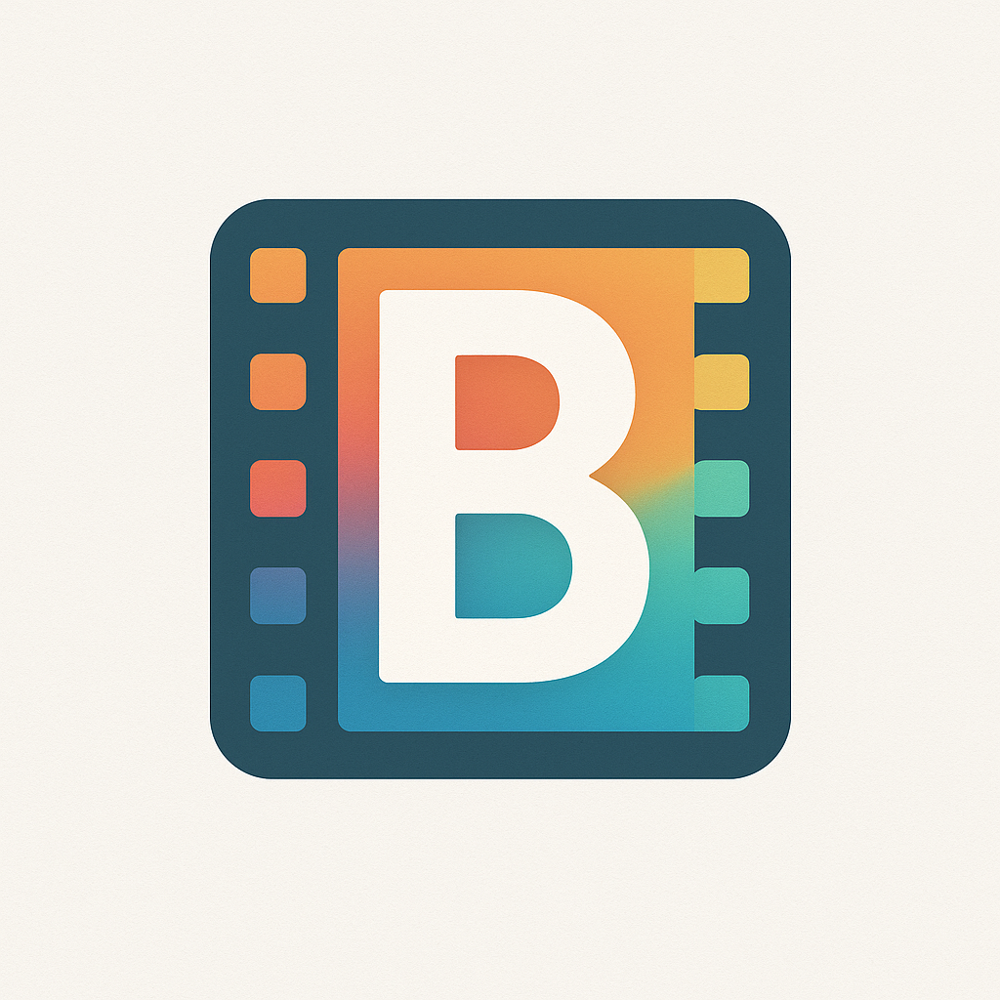

<div align="center">

[](README_EN.md)
[](README.md)

</div>

---

# LunaTV Enhanced Edition

<div align="center">
  
</div>

> 🎬 **LunaTV Enhanced Edition** is a comprehensive video streaming platform deeply customized from MoonTV. Built on top of the original version, it adds **60+ major feature enhancements** including **Multi-Provider OIDC**, **Watch Room**, **YouTube Integration**, **Cloud Drive Search**, **AI Recommendations**, **Short Drama**, **IPTV Live TV**, **Bangumi Anime**, **Playback Statistics**, **Danmaku System**, and more, delivering the ultimate online streaming experience.

<div align="center">


</div>

---

## 📢 Project Overview

This project is a deeply customized version based on **MoonTV**, continuously developed from **v4.3.1** to the current **v6.1.1**, with **60+ major feature modules** and **400+ detailed optimizations** added. See [CHANGELOG](CHANGELOG) for all new features.

### 💡 Core Enhancement Highlights

#### 🎥 Content Ecosystem Expansion
- **YouTube Integration**: Complete YouTube search, playback, live streaming with cookieless domain support
- **Cloud Drive Search (PanSou)**: Integrated advanced filtering and cache management
- **ACG Torrent Search**: Integrated ACG anime torrent resource search for rich anime content access
- **Mikan Project Integration**: ACG search dual-source system (ACG.RIP and Mikan Project), supports source switching, unified response format, and complete torrent metadata
- **Short Drama Features**: Search, playback, dedicated detail pages, mobile API proxy, auto-skip to next episode when backup API unavailable, fallback API support
- **IPTV Live TV**: m3u/m3u8 subscriptions, EPG program guide (multi-source & url-tvg support), source aggregation, logo proxy, channel search within current source, live source tab quick search, long channel name click-to-expand
- **Bangumi Anime**: Intelligent anime detection, API integration, caching mechanism, anime content details prioritize Bangumi API
- **Traditional Chinese Search Support**: Smart Traditional-Simplified conversion, multi-strategy search, lightweight switch-chinese library, optimized Traditional Chinese user search experience, intelligent search variant detection
- **2026 Year Filter**: Add 2026 year filter option for Douban content, easily find latest releases

#### 🤖 AI Recommendation System
- **AI Smart Assistant**: Global AI recommendation button (ModernNav header), GPT-5/o series support, dynamic prompts, 85-90% input latency optimization, streaming transmission, orchestrator, video context support, integrated Douban and TMDB data, auto TMDB search when ID missing
- **Short Drama AI Chat**: AI chat functionality for ShortDramaCard component, intelligent recommendations and content analysis
- **Tavily Search Mode**: Supports Tavily search mode without AI API requirement, flexible API verification, SSE streaming, friendly user guidance
- **Multiple Card Types**: Video recommendations, YouTube videos, video link parsing
- **TMDB Actor Search**: Complete actor search, filtering, and caching
- **Interactive Actor Works Viewer**: Inline actor works display in play page, 2-hour cache, TMDB fallback source
- **Release Calendar & Upcoming Releases**: Upcoming content preview and tracking, support favoriting upcoming releases, automatically becomes playable after release, 2026 release data crawler
- **TanStack Query State Management**: Implement TanStack Query for global state management, optimized data fetching and caching

#### 💬 Danmaku Ecosystem
- **Third-party Danmaku API**: Integrated Tencent Video, iQiyi, Youku, Bilibili platforms, smart content matching prevents trailers
- **Smart Performance Optimization**: Device-based tiered rendering, Web Worker acceleration, hardware acceleration
- **Comprehensive Settings Panel**: Integrated danmaku settings panel in global settings, supporting font size, speed, opacity, display area, anti-overlap adjustments
- **Smart Caching**: localStorage persistence, 30-minute cache, auto cleanup of expired data
- **Web-exclusive Input**: Simple "Danmu" button for quick sending (auto-hidden on mobile)

#### 🎬 Douban Trailer System
- **Mobile API Auto-Refresh**: Douban trailer URL expiration auto-detection and refresh mechanism
- **Dedicated Refresh Endpoint**: Independent trailer refresh API endpoint, supports manual trigger updates
- **localStorage Persistence**: Trailer URL local storage, reduces duplicate requests
- **Auto-Retry Mechanism**: 403 error auto-retry, ensures trailer continuous availability
- **Performance Logging**: Complete trailer loading performance monitoring and logging
- **TV Series Support**: Extended trailer support to TV series and non-movie content
- **🚀 Video Cache Optimization (Kvrocks)**: Two-layer cache architecture dramatically reduces traffic consumption
  - **Kvrocks Metadata Cache**: URL mapping and file info (15-minute TTL)
  - **File System Video Cache**: Local storage of video content (12-hour TTL, max 500MB)
  - **Smart Cache Hit**: After first download, subsequent requests served from local files
  - **96% Traffic Savings**: 28 requests reduced from 932MB to 33MB (real data)
  - **Response Speed Boost**: From seconds to milliseconds
  - **Auto Expiration Cleanup**: Scheduled cleanup of expired cache, freeing storage space
  - **Cache Stats API**: `GET /api/video-cache/stats` to view cache usage

#### 📊 Performance & Monitoring System
- **Performance Monitoring Dashboard**: Complete performance monitoring system supporting all APIs (Douban, search, list, details, playback records, favorites, skip config, short dramas)
- **Industry Benchmark Rating**: Built-in industry benchmark rating system for real-time API performance evaluation
- **Traffic Monitoring System**: Real-time traffic monitoring, external traffic domain breakdown, request list display with collapsible sections
- **Cron Task Monitoring**: Cron monitoring with API filtering and 48-hour auto-cleanup
- **Configurable Task Optimization**: Configurable cron task optimization to reduce outbound traffic
- **Kvrocks Persistence**: Kvrocks persistence for cron, Douban search API, and external traffic monitoring

#### 🔧 Proxy Configuration System
- **Dual-Layer Proxy Architecture**: TVBox and video playback independent proxy configs, no interference
- **Smart URL Replacement**: Auto-detect and replace playback addresses in video sources
- **Status Detection**: Proxy server health check and connectivity testing
- **Configuration Guide**: Complete proxy configuration documentation and best practices
- **Source-Level Application**: Proxy config applied to source validation endpoints and source test API

#### ⚡ M3U8 Downloader Upgrade
- **6x Speed Boost**: Concurrent download speed increased from single-thread to 6-threads
- **Download Settings UI**: Visual download configuration interface, supports custom concurrency
- **Stream-on-Demand Auto-Detection**: Smart detection and enable stream download mode
- **Batch Episode Download**: Supports batch downloading multiple episodes locally
- **Concurrent Write Optimization**: Resolved stream-on-demand mode concurrent write data loss
- **Time Range Display**: Add segment duration tracking and time range display for download tasks, show total duration for complete videos

#### 📺 EPG System Enhancement
- **Debug API Endpoint**: Dedicated EPG debug interface providing complete parsing information
- **Complete Parse Debugging**: Detailed EPG data parsing logs and error info
- **Name Fallback Matching**: tvg-id priority, supports multiple channel name matching strategies
- **Logo Extraction Display**: Auto-extract and display channel logos, supports fallback icons
- **Multi-Display Name Support**: Supports multiple channel aliases and display names
- **Reverse Mapping Optimization**: Uses reverse mapping to improve EPG name matching performance
- **Program Guide Completeness**: Supports <dl> structure, single-line programme elements, inline title tags

#### ⚡ Live Direct Connect Mode
- **Smart CORS Detection**: Auto-detect whether live sources support cross-origin access
- **Client Direct Playback**: Bypass server proxy, save bandwidth and server resources
- **Mixed Content Handling**: Optimized CORS detection handles mixed content situations
- **CORS Statistics Panel**: Admin backend displays direct/proxy mode statistics
- **Auto Fallback**: Automatically switch to proxy mode when CORS unavailable

#### 🔐 Trusted Network Mode
- **LAN Deployment Login-Free**: LAN/intranet deployments can skip login authentication, convenient for home use
- **IP Whitelist**: Support configuring trusted IP addresses or CIDR ranges
- **IPv6 Support**: Full IPv6 address whitelist configuration support
- **24-Hour Cache Optimization**: Config changes take effect immediately via cookie version mechanism

#### ⚖️ Video Source Weight System
- **Source Priority Configuration**: Set weight values for each video source to control playback source selection priority
- **Smart Source Sorting**: Auto-sort available playback sources by weight
- **Flexible Adjustment**: Visual weight adjustment in admin backend

#### 📊 User Management Enhancement
- **Multi-Provider OIDC Authentication**: Support multiple OAuth providers simultaneously (Google, Microsoft, GitHub, Facebook, WeChat, Apple, LinuxDo), users can choose their preferred login method
  - **GitHub OAuth**: Auto-adapts non-standard OIDC implementation, supports private email retrieval, dedicated API headers
  - **Apple Sign In**: Complete form_post response mode support, id_token parsing, JWKS signature verification
  - **Facebook OAuth**: Graph API v24.0 integration, supports avatar and user info retrieval
  - **WeChat Login**: Web app QR code login, supports openid and user info retrieval
  - **Backward Compatible**: Supports automatic migration from legacy single-provider configuration
- **V2 User Storage System**: SHA256 encryption, improved user management and OIDC integration
  - **V2 User Data Backup**: Backup/migration system fully supports V2 user data
- **Telegram Magic Link Authentication**: Secure and convenient Telegram-based login with auto webhook configuration
- **User Level System**: Replaces large login count numbers with friendly level display
- **Default User Group for New Users**: Auto-assign default user group for new registrations
- **User Group Filtering**: Admin backend user list supports filtering by user group
- **Playback Statistics**: Complete viewing data statistics, analysis, visualization, global/personal stats tab switching, favorites API performance monitoring
- **Dual Reminder System**: New episodes (red theme) and continue watching (blue theme) with gradient badges and halo effects
- **Global Favorites**: Cross-device synchronized favorites system, database storage, category filtering (movies, series, variety shows, short dramas, anime)
- **User Group Permissions**: Fine-grained permission control for AI Assistant, YouTube features, preselect user group API, display combined permissions
- **Inactive User Cleanup**: Smart auto-cleanup with detailed configuration and logging

#### 🎮 Player Feature Enhancement
- **Liquid-glass Frosted Glass Control Bar**: Modern frosted glass effect control bar with 12px blur background, responsive button auto-sizing, perfectly solves mobile button overflow issues
- **Watch Room Feature**: Real-time synchronized viewing experience with external server integration
  - **Global Buttons**: Watch room buttons integrated into global layout, positioned above back-to-top button
  - **Room Management**: Create/join/leave/disband rooms, supports host permission control
  - **Playback Sync**: Auto-sync play, pause, seek, episode switching
  - **User Status**: Display room members, connection status indicators
  - **Video Cards**: Show current playing content with poster and info
  - **Smart Follow**: Members auto-follow when host switches episodes (no confirmation needed)
  - **Source Switch Confirmation**: Confirmation dialog when switching video source to prevent accidental interruption
- **M3U8 Download**: Client-side M3U8 video download support, batch episode download, 6x concurrent download speed boost, download settings UI, stream-on-demand auto-detection
- **Player Buffer Optimization**: Three buffer modes (data-saving, balanced, high-quality), smart network adaptation
- **Netflix-style Smart Speed Test**: Real-time network speed testing, intelligent early stop mechanism, auto-recommend optimal buffer mode
- **Anime4K Super Resolution**: WebGPU-accelerated real-time video super-resolution for quality enhancement
- **Custom Ad Filter**: Support custom ad filtering rule code, separate reset and restore default buttons
- **Chromecast Casting**: Smart browser detection, auto-excludes OPPO, Xiaomi, Huawei, Samsung vendor browsers
- **iPad/iOS Optimization**: HLS.js official source optimization, smart device detection, multi-attempt autoplay strategy
- **Skip Intro/Outro**: Real-time marking button, draggable floating config window, remaining time mode, position persistence
  - **Short Video Skip Detection**: Optimized skip detection logic for short videos
- **Live DVR Detection**: Auto-detect DVR/timeshift support after player loads, display seekable time range, one-click enable progress bar mode
- **Source Switch Progress Retention**: Retain playback progress when switching video sources
- **Mobile Optimization**: Volume control hover optimization, responsive controller, danmaku config desktop-only display
- **Episode Group Scrolling**: Playback page episode selection supports scroll pagination for smooth browsing

#### 📱 Interface Experience Optimization
- **Netflix-style HeroBanner**: Homepage hero banner with trailer autoplay and backdrop, backdrop placeholder support, auto-refresh Douban trailer URLs on expiry (localStorage persistence + 403 error auto-retry), perfectly solves trailer cache expiration issues
  - **HD Background Images**: Background images always use high-definition versions
  - **Valid URL Rendering**: Only render valid trailer URLs
  - **Volume Button Optimization**: Adjusted volume button position to avoid overlap
- **Mobile Navigation Complete Redesign**: Bottom navigation adopts Netflix-style full-width layout
  - **Design Evolution**: Floating capsule → Bottom docked → Full-width layout
  - **ModernNav Redesign**: Full-width style modern navigation bar
  - **Performance Optimization**: Added prefetch={false}, light mode support, transition-based FastLink component
- **Material UI Tabs CategoryBar**: Brand new industrial-style category selector for live TV and playback pages, using Material UI Tabs for reliable scrolling and responsive design, replacing previous manual scroll implementation
  - **Douban Category Selector Scroll Optimization**: Using requestAnimationFrame to optimize scroll performance
- **Netflix-style Badge System**: Unified all badges (episode badges, notification badges, source indicators) with Netflix-style design and glassmorphism effect control buttons
- **Hero Banner Full Category Support**: Homepage auto-rotating hero banner supports all content types (movies, series, variety shows, short dramas, anime), gradient background design
- **Modern Navigation UI**: Desktop horizontal top navbar, mobile Liquid Glass bottom navigation, responsive switching
- **Mobile Banner Optimization**: Swipeable card-style layout with touch gesture navigation, better suited for mobile devices
- **TVBox Diagnostics Mobile Optimization**: Optimized TVBox diagnostic page mobile layout, prevent text overflow, completed all component mobile responsive fixes
- **Virtual Scrolling**: react-window 2.2.0, smooth loading for massive content, smart container size detection (ResizeObserver)
- **Virtual Scrolling Toggle**: Gradient styles, icons, animations, user switchable display modes
- **Responsive Grid**: 2-8 column adaptive, auto-calculated optimal layout
- **Douban Details Enhancement**: Complete rating, cast & crew, premiere date, duration, production info, poster proxy to prevent 403 errors, 24-hour cache optimization
  - **Douban Pagination Optimization**: Unified pagination constants prevent inconsistency, added deduplication logic prevents duplicates, optimized image preloading and API proxy ensure CORS safety
- **Douban Reviews Integration**: Play page displays Douban user reviews, providing richer film discussion and viewing experience
- **Celebrity Avatars & Recommendations**: Play page displays celebrity avatars (supports celebrity and personage URLs), similar movie recommendations, smart image proxy (auto-migrate from direct to server mode)
- **Completed Series Episode Count**: Search and category pages display total episode count for completed series, helping users understand content scale at a glance
- **Anime Category Default Sorting**: Default to "Recent Popularity" sorting for anime category pages
- **User Menu Features**: Update reminders, continue watching (with new episode badges), favorites quick access, TVBox settings integration
- **Login Interface Modernization**: Dynamic random wallpapers, gradient cards, responsive design
- **Back to Top Button**: Quick return for long pages like release calendar
- **Mobile Layout Optimization**: Reduced header height, tighter layout design, fixed excessive spacing issues

#### 🔐 Security & Storage
- **TVBox Complete Ecosystem**:
  - IP whitelist, user-specific Token authentication, full API compatibility, intelligent search proxy
  - Manual source toggle control, complete source parsing support
  - TVBox Intelligent Search Proxy with adult content filtering, path prefix support, UI controls
  - Deep JAR diagnostic system (file header verification, smart health check)
  - Spider management system (multi-Spider JAR backup sources, fallback proxy, gaotianliuyun third backup source)
  - Regular user access support (`/api/tvbox-config` endpoint)
- **Adult Content Management**: Dual-layer filtering system, auto-detection, batch operations, user/group-level controls
- **Video Source Import/Export**: Array/config file format export, backup & migration, quick copy buttons
- **Subscription Source Management**: Replace subscription sources instead of merging, support auto-fetch remote config
- **Fallback API Support**: Search and homepage data loading support fallback APIs, auto-switching when primary API fails, improving system stability and availability
- **Source Browser & Testing Module**: Source testing, health checks, mobile responsive layout
- **Resource Search API Authentication**: Enhanced security with user authentication
- **Calendar Cache Migration**: Migrated from localStorage to database, cross-device sync support, cache duration optimized from 24 hours to 8 hours
- **Favorites Database Storage**: Global favorites data stored in database, supporting cross-device sync and category management
- **Cache Optimization**: Unified cache management (YouTube, cloud drive, Douban, danmaku), version check dual-layer cache and request deduplication optimization
- **Enhanced Storage Modes**: Full Kvrocks/Redis/Upstash support, memory cache prevents QuotaExceededError, handles Redis tag serialization
- **User Registration System** (configurable toggle)
- **Image Proxy Optimization**: Improved image proxy performance and caching strategy, supports Baidu image proxy option, provides more proxy methods
- **Douban Anti-Crawler Verification**: Douban anti-crawler verification mechanism with Cookies authentication support, improving data acquisition stability
- **Enhanced Ad Filtering**: Keyword-based intelligent ad detection, automatic identification and filtering of ad content

---

## ⚠️ Important Notices

### 📦 Project Status

- **Notice**: After deployment, this is an **empty shell project** with **no built-in video sources or live streaming sources**. You need to collect and configure them yourself.
- **Demo Sites**:
  - Zeabur Deployment: [https://smonetv.zeabur.app](https://smonetv.zeabur.app)
  - Vercel Deployment: [https://lunatv.smone.us](https://lunatv.smone.us)
  - For short-term testing. Database is cleaned regularly.

### 🚫 Distribution Restrictions

**Do NOT promote this project on Bilibili, Xiaohongshu (RedNote), WeChat Official Accounts, Douyin (TikTok China), Toutiao, or other Chinese mainland social platforms through videos or articles. This project does NOT authorize any "Tech Weekly/Monthly" projects or sites to include it.**

### 📜 Open Source License

This project is licensed under **CC BY-NC-SA 4.0**, with the following terms:
- ❌ **Commercial use is prohibited**
- ✅ **Personal learning and use is allowed**
- ✅ **Derivative works and distribution are allowed**
- ⚠️ **Any derivative projects must retain this project's address and be open-sourced under the same license**

---

## ✨ Complete Feature List

### 🎬 Content Aggregation
- ✅ Multi-source video aggregation search (streaming output, smart variants, language-aware filtering, fallback API support, Traditional Chinese support)
- ✅ YouTube integration (search, live streaming, iframe playback, time filtering & sorting)
- ✅ Cloud drive search (PanSou integration, advanced filtering, cache management)
- ✅ ACG torrent search (ACG.RIP and Mikan Project dual-source system, source switching, unified response format, complete torrent metadata)
- ✅ Short drama features (search, playback, dedicated detail pages, mobile API proxy)
- ✅ IPTV live TV (m3u subscriptions, EPG guide, multi-source support, url-tvg, source aggregation, channel search, long channel name click-to-expand)
- ✅ Bangumi anime (info detection, API integration, 3-6 digit ID support)
- ✅ TMDB actor search (filtering, caching)
- ✅ Completed series episode count (displays total episode count on search and category pages)
- ✅ 2026 year filter (Douban content year filtering)

### 🤖 Smart Recommendations
- ✅ AI recommendation system (GPT-5/o support, dynamic prompts)
- ✅ Short Drama AI Chat (ShortDramaCard component AI chat functionality, intelligent recommendations and content analysis)
- ✅ TanStack Query state management (global state management, optimized data fetching and caching)
- ✅ Release calendar (upcoming content preview)
- ✅ Douban details enhancement (complete cast & crew info, user reviews display)
- ✅ Smart search optimization (language-aware, fuzzy matching)

### 💬 Danmaku System
- ✅ Third-party danmaku API (Tencent, iQiyi, Youku, Bilibili, caiji.cyou multi-platform aggregation)
- ✅ Smart content matching (auto-filter commentary, trailers, irrelevant content)
- ✅ Smart performance optimization (device tiering, Web Worker, hardware acceleration, segmented loading)
- ✅ Complete configuration (font size, speed, opacity, display area, anti-overlap, type masking)
- ✅ Smart caching (localStorage, 30-min expiry, page refresh persistence)
- ✅ Danmaku input (web-only "Danmu" button, auto-hidden on mobile)
- ✅ EXT-X-MEDIA URI handling (prevents HLS audio track loading errors)

### 📊 User Management
- ✅ Telegram Magic Link authentication (secure convenient login, auto webhook config)
- ✅ User level system (replaces large login count numbers)
- ✅ Playback statistics (watch time, video count, recent records, global/personal tab switching)
- ✅ Dual reminder system (new episodes red theme, continue watching blue theme, gradient badges)
- ✅ Global favorites (cross-device sync, database storage, category filtering: movies/series/variety/short dramas/anime)
- ✅ VideoCard watch update display (replaces popup-style updates)
- ✅ User group permissions (AI, YouTube feature control)
- ✅ Inactive user auto-cleanup (smart config, logging)
- ✅ Login time tracking (enhanced admin analytics)

### 🎮 Player Enhancement
- ✅ Liquid-glass frosted glass control bar (12px blur, responsive buttons, perfect mobile adaptation)
- ✅ Chromecast casting (smart browser detection, excludes vendor browsers)
- ✅ iPad/iOS optimization (HLS.js official source optimization, smart device detection, multi-attempt autoplay retry)
- ✅ Skip intro/outro (real-time marking button, draggable floating window, remaining time mode, cross-episode support)
- ✅ Live DVR detection (auto-detect DVR/timeshift support after player loads, display seekable time range, one-click enable progress bar mode)
- ✅ Danmaku config panel (desktop display, mobile hidden, optimized display and interaction)
- ✅ Volume control optimization (hover area optimization, precise detection)
- ✅ Episode switching optimization (debounce, state management, correct playback time reset)
- ✅ Episode group scroll pagination (smooth browsing for large episode counts)

### 🎨 Interface Experience
- ✅ Hero banner (homepage auto-rotating, gradient backgrounds, enhanced visual appeal, full category support for all content types)
- ✅ Modern navigation UI (desktop horizontal top bar, mobile Liquid Glass bottom nav, responsive switching)
- ✅ Mobile banner optimization (swipeable card-style layout, touch gesture navigation, better mobile experience)
- ✅ Mobile layout optimization (reduced header height, tighter layout, fixed excessive spacing)
- ✅ Virtual scrolling (react-window 2.2.0, ResizeObserver smart detection, progressive loading)
- ✅ Virtual scrolling toggle (gradient styles, icons, animations, user switchable)
- ✅ Responsive grid (2-8 column adaptive, actual container width dynamic calculation)
- ✅ Douban details enhancement (rating, cast & crew, premiere date, duration, production info, poster proxy to prevent 403)
- ✅ Douban reviews integration (play page displays user reviews, enriched viewing experience)
- ✅ Completed series episode count (search and category pages display total episode count, content scale at a glance)
- ✅ User menu enhancement (update reminders, continue watching with new episode badges, favorites quick access, TVBox settings)
- ✅ Login/register modernization (dynamic random wallpapers, gradient cards, responsive design)
- ✅ Back to top button (long pages like release calendar)
- ✅ Completed series badges (based on vod_remarks, search API priority)
- ✅ Search result filtering (source, title, year filtering, year sorting)
- ✅ Video card right-click/long-press menu (new tab play, favorites, etc.)
- ✅ Short drama card right-click/long-press menu (context menu with quick actions support)
- ✅ z-index hierarchy optimization (cards, badges, modals display correctly)

### 🔐 Security & Storage
- ✅ TVBox complete ecosystem (IP whitelist, user-specific Token auth, full API compatibility, intelligent search proxy, manual source toggle, complete source parsing)
- ✅ TVBox intelligent search proxy (adult content filtering, path prefix support, UI controls)
- ✅ Trusted network mode (LAN deployment login-free, IP whitelist, IPv6 support, 24-hour cache optimization)
- ✅ Video source weight system (source priority configuration, smart source sorting, visual adjustment)
- ✅ Adult content management system (dual-layer filtering, auto-detection, batch operations, user/group-level controls)
- ✅ Video source import/export (array/config file formats, backup & migration, quick copy buttons)
- ✅ Fallback API support (primary API failure auto-switching, improved system stability)
- ✅ TVBox deep diagnostics (JAR file header verification, smart health check, config field display)
- ✅ Spider management system (multi-JAR backup sources, fallback proxy, gaotianliuyun third backup source)
- ✅ Source browser & testing module (source testing, health checks, mobile responsive)
- ✅ Resource search API authentication (enhanced security)
- ✅ Calendar cache database migration (cross-device sync)
- ✅ Favorites database storage (cross-device sync, category management)
- ✅ Unified cache management system (YouTube, cloud drive, Douban, danmaku)
- ✅ Kvrocks/Redis/Upstash storage (full compatibility handling)
- ✅ Memory cache prevents QuotaExceededError (Kvrocks/Upstash memory cache)
- ✅ User registration system (configurable toggle, admin user creation)
- ✅ Cross-device original episode tracking (prevents API cache issues)
- ✅ Image proxy optimization (performance improvements, Baidu image proxy option, caching strategy optimization)

### 🛠️ Technical Optimization
- ✅ ArtPlayer 5.3.0 + HLS.js 1.6.15 (official source optimization)
- ✅ Danmaku plugin 5.2.0 (Web Worker acceleration, useWorker: true, lockTime: 2)
- ✅ Next.js SSR compatibility (dynamic import, client-side loading)
- ✅ Docker build optimization (no-cache flag, dependency verification)
- ✅ TypeScript type safety (const assertion, type annotations)
- ✅ Semantic versioning (Git tag-based, CHANGELOG auto-extraction)
- ✅ HLS.js mobile optimization (buffer strategy, memory management, ABR optimization)
- ✅ Douban details engine refactor (accurate parsing based on real HTML structure)
- ✅ Performance monitoring system (complete performance monitoring dashboard, all API support, industry benchmark rating system)
- ✅ Traffic monitoring system (real-time traffic monitoring, external traffic domain breakdown, request list display with collapsible sections)
- ✅ Cron task monitoring (cron monitoring, API filtering, 48-hour auto-cleanup)
- ✅ Kvrocks persistence (for cron, Douban search API, and external traffic monitoring)
- ✅ Video caching system (12-hour TTL video cache, Kvrocks metadata cache, filesystem video cache, smart cache hits)

---

## 🗺 Table of Contents

- [Tech Stack](#-tech-stack)
- [Deployment](#-deployment)
  - [Docker Deployment (Recommended)](#-recommended-kvrocks-storage)
  - [fnOS Deployment](#-fnos-feiniao-nas-deployment)
  - [Zeabur Deployment (Recommended)](#️-zeabur-deployment-recommended)
  - [Hugging Face Space Deployment (Free)](#-hugging-face-space-deployment-free)
  - [EdgeOne Pages Deployment (Free)](#-edgeone-pages-deployment-free)
  - [Vercel Deployment (Serverless)](#-vercel-deployment-serverless)
- [Configuration File](#️-configuration-file)
- [Environment Variables](#-environment-variables)
- [Feature Configuration](#️-feature-configuration)
- [Auto Update](#-auto-update)
- [Mobile App Usage](#-mobile-app-usage)
- [AndroidTV / Tablet Usage](#-androidtv--tablet-usage)
- [Changelog](#-changelog)
- [Security & Privacy Notice](#-security--privacy-notice)
- [License](#-license)
- [Acknowledgments](#-acknowledgments)

---

## 🔧 Tech Stack

| Category      | Main Dependencies                                                                                              |
| ------------- | -------------------------------------------------------------------------------------------------------------- |
| Frontend      | [Next.js 16.1.0](https://nextjs.org/) · App Router                                                           |
| UI & Styling  | [Tailwind CSS 4.1.18](https://tailwindcss.com/) · [Framer Motion 12.18.1](https://www.framer.com/motion/)          |
| Language      | TypeScript 5.8.3                                                                                               |
| Player        | [ArtPlayer 5.3.0](https://github.com/zhw2590582/ArtPlayer) · [HLS.js 1.6.15](https://github.com/video-dev/hls.js/) · [artplayer-plugin-danmuku 5.2.0](https://github.com/zhw2590582/ArtPlayer) |
| State Mgmt    | React 19.0.0 Context API · React Hooks                                                                                |
| Data Storage  | Kvrocks · Redis · Upstash · localStorage                                                                       |
| Virtualization| [react-window 2.2.3](https://github.com/bvaughn/react-window) · ResizeObserver                                |
| UI Components | [@headlessui/react 2.2.4](https://headlessui.com/) · [Lucide Icons 0.438.0](https://lucide.dev/) · [React Icons 5.4.0](https://react-icons.github.io/react-icons/) |
| Code Quality  | ESLint 9.28.0 · Prettier 3.5.3 · Jest 29.7.0 · Husky 7.0.4                                                                               |
| Deployment    | Docker · Docker Compose · pnpm 10.14.0                                                                                        |

---

## 🚀 Deployment

### 💻 Minimum System Requirements

To ensure smooth operation, your server should meet the following minimum specifications:

#### Docker Self-Hosted Deployment
- **CPU**: 2 cores (4 cores recommended)
- **RAM**: 2GB (4GB recommended)
- **Storage**: 10GB available space (20GB recommended for video cache and database)
- **Network**: 10Mbps upload bandwidth (100Mbps recommended)

#### Zeabur / Vercel Cloud Deployment
- **No Server Required**: Platform automatically allocates resources
- **Zeabur**: Developer Plan provides up to 2 vCPU and 4GB RAM ($5/month with $5 credit, free if usage doesn't exceed credit)
- **Vercel**: Serverless architecture with automatic scaling

#### ⚠️ Common Performance Issues
- ❌ **Insufficient CPU**: Single-core or low-frequency CPU causes slow video transcoding and search
- ❌ **Low Memory**: Less than 2GB RAM leads to frequent OOM (Out of Memory) errors
- ❌ **Low Bandwidth**: Upload bandwidth below 5Mbps causes video playback stuttering
- ❌ **Slow Disk I/O**: Using HDD affects database and cache performance

**💡 Tip**: If you experience lag, please check if your server meets the minimum requirements first!

---

### ⚡ One-Click Deploy to Zeabur (Easiest)

Click the button below for one-click deployment, automatically configures LunaTV + Kvrocks database:

[](https://zeabur.com/templates/2425O0/deploy)

**Advantages**:
- ✅ Zero configuration, instant startup (auto-deploy complete environment)
- ✅ Automatic HTTPS and global CDN acceleration
- ✅ Persistent storage, data never lost
- ✅ Free tier sufficient for personal use

**⚠️ Important Notice**: After deployment completes, you need to set up an access domain (Domain) for the LunaTV service in Zeabur before you can access it in your browser. See the [Set Up Access Domain](#5-set-up-access-domain-required) step below for details.

After clicking the button, just fill in the environment variables to complete deployment! See [Zeabur Deployment Guide](#️-zeabur-deployment-recommended) below for details.

---

### 🐳 Docker Self-Hosted Deployment

This project **only supports Docker or Docker-based platforms** (such as Dockge, Portainer, Komodo, etc.).

### 📦 Recommended: Kvrocks Storage

Kvrocks is a persistent Redis-compatible storage based on RocksDB, recommended for production environments.

```yml
services:
  moontv-core:
    image: ghcr.io/szemeng76/lunatv:latest
    container_name: moontv-core
    restart: on-failure
    ports:
      - '3000:3000'
    environment:
      - USERNAME=admin
      - PASSWORD=your_secure_password
      - NEXT_PUBLIC_STORAGE_TYPE=kvrocks
      - KVROCKS_URL=redis://moontv-kvrocks:6666
      - VIDEO_CACHE_DIR=/app/video-cache  # Video cache directory
      # Optional: Site configuration
      - SITE_BASE=https://your-domain.com
      - NEXT_PUBLIC_SITE_NAME=LunaTV Enhanced
    volumes:
      - video-cache:/app/video-cache  # Video cache persistence
    networks:
      - moontv-network
    depends_on:
      - moontv-kvrocks

  moontv-kvrocks:
    image: apache/kvrocks
    container_name: moontv-kvrocks
    restart: unless-stopped
    volumes:
      - kvrocks-data:/var/lib/kvrocks
    networks:
      - moontv-network

networks:
  moontv-network:
    driver: bridge

volumes:
  kvrocks-data:
  video-cache:  # Video cache volume
```

### 🔴 Redis Storage (Risk of Data Loss)

Redis default configuration may lead to data loss. Persistence must be enabled.

```yml
services:
  moontv-core:
    image: ghcr.io/szemeng76/lunatv:latest
    container_name: moontv-core
    restart: on-failure
    ports:
      - '3000:3000'
    environment:
      - USERNAME=admin
      - PASSWORD=your_secure_password
      - NEXT_PUBLIC_STORAGE_TYPE=redis
      - REDIS_URL=redis://moontv-redis:6379
    networks:
      - moontv-network
    depends_on:
      - moontv-redis

  moontv-redis:
    image: redis:alpine
    container_name: moontv-redis
    restart: unless-stopped
    command: redis-server --save 60 1 --loglevel warning
    volumes:
      - ./data:/data
    networks:
      - moontv-network

networks:
  moontv-network:
    driver: bridge
```

### ☁️ Upstash Cloud Storage (Docker)

Suitable for scenarios where self-hosted databases are not available. Fully managed Redis service.

1. Register an account at [upstash.com](https://upstash.com/) and create a Redis instance
2. Copy **HTTPS ENDPOINT** and **TOKEN**
3. Use the following configuration:

```yml
services:
  moontv-core:
    image: ghcr.io/szemeng76/lunatv:latest
    container_name: moontv-core
    restart: on-failure
    ports:
      - '3000:3000'
    environment:
      - USERNAME=admin
      - PASSWORD=your_secure_password
      - NEXT_PUBLIC_STORAGE_TYPE=upstash
      - UPSTASH_URL=https://your-instance.upstash.io
      - UPSTASH_TOKEN=your_upstash_token
```

### 🚀 fnOS (Feiniao NAS) Deployment

fnOS is a free domestic NAS system with native Docker Compose support, ideal for home NAS users.

#### Deployment Method 1: Web Interface (Recommended)

1. **Login to fnOS Management Interface**
   - Access fnOS Web management interface
   - Navigate to "Docker" or "Container Management" page

2. **Create Compose Project**
   - Click "New Compose Project" or "Add Service"
   - Project name: `lunatv`
   - Paste the [Kvrocks Storage Configuration](#-recommended-deployment-kvrocks-storage) into the configuration box

3. **Modify Configuration**
   - Change `PASSWORD` to a strong password
   - (Optional) Modify `SITE_BASE` to your access address

4. **Start Service**
   - Click "Start" or "Deploy" button
   - Wait for containers to start

5. **Access Application**
   - Browser access: `http://fnOS-IP:3000`
   - Login with configured admin credentials

#### Deployment Method 2: SSH Command Line

```bash
# SSH login to fnOS
ssh root@fnOS-IP

# Create project directory
mkdir -p /volume1/docker/lunatv
cd /volume1/docker/lunatv

# Create docker-compose.yml file
nano docker-compose.yml
# Paste Kvrocks configuration, save and exit

# Start service
docker-compose up -d

# View logs
docker-compose logs -f
```

#### 📝 fnOS Deployment Notes

- **Image Acceleration**: Recommended to configure Docker image acceleration in fnOS (Settings → Docker → Image Registry), use Xuanyuan Mirror
- **Port Conflicts**: Ensure port 3000 is not occupied. If conflicted, modify to another port (e.g., `3001:3000`)
- **Data Persistence**: Volume `kvrocks-data` will be automatically created in fnOS Docker data directory
- **Reverse Proxy**: Can use fnOS reverse proxy feature for domain access and HTTPS
- **Update Images**: In Docker management interface, select container → Update Image → Restart

#### ✨ fnOS Deployment Advantages

- ✅ **Graphical Management**: Simple and intuitive web interface
- ✅ **One-Click Update**: Built-in container image update functionality
- ✅ **Data Security**: NAS-level data protection and backup
- ✅ **Network Acceleration**: Supports configuring image acceleration sources
- ✅ **Resource Monitoring**: Real-time container resource usage monitoring

---

### ☁️ Zeabur Deployment (Recommended)

Zeabur is a one-stop cloud deployment platform. Using pre-built Docker images allows for quick deployment without waiting for builds.

**Deployment Steps:**

1. **Add KVRocks Service** (Add database first)
   - Click "Add Service" > "Docker Images"
   - Enter image name: `apache/kvrocks`
   - Configure port: `6666` (TCP)
   - **Remember the service name** (usually `apachekvrocks`)
   - **Configure Persistent Volume (Important)**:
     * Find "Volumes" section in service settings
     * Click "Add Volume" to add new volume
     * Volume ID: `kvrocks-data` (customizable, only letters, numbers, and hyphens)
     * Path: `/var/lib/kvrocks/db`
     * Save configuration

   > 💡 **Important**: Persistent volume path must be set to `/var/lib/kvrocks/db` (KVRocks data directory). This keeps config files in the container while persisting database files, preventing data loss on restart!

2. **Add LunaTV Service**
   - Click "Add Service" > "Docker Images"
   - Enter image name: `ghcr.io/szemeng76/lunatv:latest`
   - Configure port: `3000` (HTTP)

3. **Configure Environment Variables**

   Add the following environment variables to your LunaTV service:

   ```env
   # Required: Admin Account
   USERNAME=admin
   PASSWORD=your_secure_password

   # Required: Storage Configuration
   NEXT_PUBLIC_STORAGE_TYPE=kvrocks
   KVROCKS_URL=redis://apachekvrocks:6666
   VIDEO_CACHE_DIR=/app/video-cache

   # Optional: Site Configuration
   SITE_BASE=https://your-domain.zeabur.app
   NEXT_PUBLIC_SITE_NAME=LunaTV Enhanced
   ANNOUNCEMENT=Welcome to LunaTV Enhanced Edition

   # Optional: Douban Proxy (Recommended)
   NEXT_PUBLIC_DOUBAN_PROXY_TYPE=cmliussss-cdn-tencent
   NEXT_PUBLIC_DOUBAN_IMAGE_PROXY_TYPE=cmliussss-cdn-tencent
   ```

   **Note**:
   - Use service name as hostname: `redis://apachekvrocks:6666`
   - Replace with actual service name if different
   - Both services must be in the same Project

4. **Deployment Complete**
   - Zeabur will automatically pull images and start services
   - After services are ready, you need to manually set up an access domain (see next step)

#### 5. Set Up Access Domain (Required)

   - In the LunaTV service page, click the "Networking" or "Network" tab
   - Click "Generate Domain" to create a free Zeabur domain (e.g., `xxx.zeabur.app`)
   - Or bind a custom domain:
     * Click "Add Domain" to add your domain
     * Follow the prompts to configure DNS CNAME record pointing to the Zeabur-provided target
   - Once the domain is set up, you can access LunaTV through the domain

6. **Bind Custom Domain (Optional)**
   - In service settings, click "Domains"
   - Add your custom domain
   - Configure DNS CNAME record to point to the Zeabur-provided domain

#### 🔄 Updating Docker Images

When a new Docker image version is released, Zeabur won't automatically update. Manual trigger is required.

**Update Steps:**

1. **Enter Service Page**
   - Click on the service you want to update (LunaTV or KVRocks)

2. **Restart Service**
   - Click on the **"Overview"** page, and then click the **"Restart"** button
   - Zeabur will automatically pull the latest `latest` image and redeploy

> 💡 **Tips**:
> - When using `latest` tag, Restart will automatically pull the latest image
> - For production environments, it's recommended to use fixed version tags (e.g., `v5.5.5`) to avoid unexpected updates

#### ✨ Zeabur Deployment Advantages

- ✅ **Automatic HTTPS**: Free SSL certificate auto-configured
- ✅ **Global CDN**: Built-in worldwide acceleration
- ✅ **Zero-Config Deployment**: Automatic Dockerfile detection
- ✅ **Service Discovery**: Containers communicate via service names automatically
- ✅ **Persistent Storage**: Volume mounting support
- ✅ **CI/CD Integration**: Auto-deployment on Git push
- ✅ **Real-time Logs**: Web interface for runtime logs

#### ⚠️ Zeabur Considerations

- **Pricing Model**: Pay-as-you-go based on actual resource usage, free tier sufficient for small projects
- **Region Selection**: Recommend choosing the region closest to your users
- **Service Networking**: Services in the same Project communicate via service names (e.g., `apachekvrocks:6666`)
- **Persistent Storage**: KVRocks must configure persistent volume to `/var/lib/kvrocks/db` directory, otherwise data will be lost on restart

---

### 🤗 Hugging Face Space Deployment (Free)

[Hugging Face Spaces](https://huggingface.co/spaces) offers free Docker container hosting with **2 vCPU, 16GB RAM, and 50GB storage**, perfect for personal use.

#### Deployment Steps

1. **Create Hugging Face Account**
   - Visit [huggingface.co](https://huggingface.co/) and register

2. **Create New Space**
   - Visit [huggingface.co/new-space](https://huggingface.co/new-space)
   - Enter Space name (e.g., `lunatv`)
   - **Space SDK**: Select `Docker`
   - **Space hardware**: Select `CPU basic` (Free)
   - Click `Create Space`

3. **Configure README.md**

   Create or edit `README.md` in the Space repository root with YAML metadata:

   ```yaml
   ---
   title: LunaTV
   emoji: 🎬
   colorFrom: green
   colorTo: blue
   sdk: docker
   app_port: 3000
   pinned: false
   ---
   ```

   > 💡 **Key config**: `app_port: 3000` tells HF the app runs on port 3000

4. **Create Dockerfile**

   Create `Dockerfile` in the Space repository root with just one line:

   ```dockerfile
   FROM ghcr.io/szemeng76/lunatv:latest
   ```

   > 💡 This uses the official LunaTV Docker image directly, no build required

5. **Configure Environment Variables (Secrets)**

   On Space page, click `Settings` > `Variables and secrets`, add these Secrets:

   | Variable | Description | Example |
   |----------|-------------|---------|
   | `USERNAME` | Admin username | `admin` |
   | `PASSWORD` | Admin password | `your_secure_password` |
   | `NEXT_PUBLIC_STORAGE_TYPE` | Storage type | `upstash` |
   | `UPSTASH_URL` | Upstash REST URL | `https://xxx.upstash.io` |
   | `UPSTASH_TOKEN` | Upstash Token | `AxxxQ==` |
   | `DISABLE_HERO_TRAILER` | Disable homepage trailer | `true` |

   > ⚠️ **Note**: HF Space has no persistent storage, must use external database like Upstash
   >
   > 💡 **Recommended**: Set `DISABLE_HERO_TRAILER=true` to disable homepage trailer, as trailer URLs expire periodically and platforms without persistent storage cannot cache videos, requiring re-download on every refresh

6. **Wait for Deployment**
   - After committing files, HF will automatically pull the image and start the container
   - Once deployed, visit `https://huggingface.co/spaces/your-username/lunatv`

#### 📁 Complete File Structure

```
your-space/
├── README.md      # Contains YAML metadata
└── Dockerfile     # FROM ghcr.io/szemeng76/lunatv:latest
```

#### ✨ Hugging Face Space Advantages

- ✅ **Completely Free**: 2 vCPU, 16GB RAM, 50GB storage
- ✅ **No Server Required**: Hosted on HF cloud
- ✅ **Auto HTTPS**: Built-in SSL certificate
- ✅ **Simple Deployment**: Only two files needed
- ✅ **Official Image**: No build required, direct pull

#### ⚠️ Hugging Face Space Considerations

- **No Persistent Storage**: Must use external database like Upstash
- **Cold Start**: First access after long idle period is slow (~30-60 seconds)
- **48-hour Sleep**: Free tier sleeps after 48 hours of inactivity, restarts on next access
- **Public Repository**: Space repository is public by default, except Secrets
- **Traffic Limits**: Free tier has traffic limits, sufficient for personal use

#### 🔗 Related Links

- [Hugging Face Spaces Docs](https://huggingface.co/docs/hub/spaces)
- [Docker Spaces Docs](https://huggingface.co/docs/hub/spaces-sdks-docker)
- [Upstash Free Redis](https://upstash.com/)

---

### 🌐 EdgeOne Pages Deployment (Free)

[EdgeOne Pages](https://edgeone.ai/products/pages) is Tencent Cloud's edge computing platform, similar to Vercel, supporting Next.js SSR/SSG/ISR deployment, ideal for users in China.

#### Deployment Steps

1. **Prerequisites**
   - Register an [EdgeOne](https://edgeone.ai/) account
   - Create a Redis instance on [Upstash](https://upstash.com/) (EdgeOne Pages has no persistent storage)
   - Fork this project to your GitHub/GitLab account

2. **Create Pages Project**
   - Login to EdgeOne Console
   - Go to "Pages" > "Create Project"
   - Select "Connect Git Repository"
   - Authorize and select your forked LunaTV repository

3. **Configure Build Settings**
   - **Framework Preset**: Select `Next.js`
   - **Build Command**: `pnpm build` (or keep default)
   - **Output Directory**: `.next` (default)
   - **Node.js Version**: `20` (recommended)

4. **Configure Environment Variables**

   Add the following environment variables in project settings:

   ```env
   # Required: Admin account
   USERNAME=admin
   PASSWORD=your_secure_password

   # Required: Storage configuration (must use Upstash)
   NEXT_PUBLIC_STORAGE_TYPE=upstash
   UPSTASH_URL=https://your-redis-instance.upstash.io
   UPSTASH_TOKEN=AxxxxxxxxxxxxxxxxxxxxxxxxxxxQ==

   # Recommended: Disable homepage trailer (recommended for platforms without persistent storage)
   DISABLE_HERO_TRAILER=true

   # Optional: Site configuration
   SITE_BASE=https://your-project.edgeone.app
   NEXT_PUBLIC_SITE_NAME=LunaTV Enhanced

   # Optional: Douban proxy configuration (recommended)
   NEXT_PUBLIC_DOUBAN_PROXY_TYPE=cmliussss-cdn-tencent
   NEXT_PUBLIC_DOUBAN_IMAGE_PROXY_TYPE=cmliussss-cdn-tencent
   ```

5. **Deploy Project**
   - Click "Deploy" button
   - Wait for build to complete (first time ~3-5 minutes)
   - After deployment, you'll get a `xxx.edgeone.app` domain

6. **Bind Custom Domain (Optional)**
   - Click "Domains" in project settings
   - Add custom domain and configure DNS resolution

#### ✨ EdgeOne Pages Advantages

- ✅ **China-Friendly**: Tencent Cloud edge nodes, fast access in China
- ✅ **Generous Free Tier**: 3M Edge Functions requests, 1M Cloud Functions requests, 500 builds per month, unlimited traffic
- ✅ **Auto HTTPS**: Free SSL certificate
- ✅ **Git Auto Deploy**: Push code triggers automatic build
- ✅ **Next.js SSR Support**: Full server-side rendering support

#### ⚠️ EdgeOne Pages Considerations

- **No Docker Support**: EdgeOne Pages is serverless, only supports source code build deployment
- **Must Use Upstash**: No persistent filesystem, requires external database
- **Function Execution Limits**: Single request has execution time limit (typically 30 seconds)
- **No Video Caching**: No local filesystem, video caching feature unavailable
- **Build Resource Limits**: Free tier has build time and memory limits

#### 🔗 Related Links

- [EdgeOne Pages Pricing](https://pages.edgeone.ai/pricing)
- [EdgeOne Pages Docs (International)](https://edgeone.ai/zh/document/160427672961769472)
- [EdgeOne Pages Docs (China)](https://cloud.tencent.com/document/product/1552/127366)
- [Upstash Free Redis](https://upstash.com/)

---

## 🌐 Vercel Deployment (Serverless)

### Vercel + Upstash Solution

Perfect for users without servers. Completely free deployment (Vercel Free Tier + Upstash Free Tier).

#### Prerequisites

1. **Create Upstash Redis Instance**
   - Visit [upstash.com](https://upstash.com/)
   - Register and create a new Redis database
   - Select region (choose the closest to your location)
   - Copy **REST URL** and **REST TOKEN**

2. **Fork This Project**
   - Fork this repository to your GitHub account

#### Deployment Steps

1. **Import to Vercel**
   - Visit [vercel.com](https://vercel.com/)
   - Login and click "Add New" > "Project"
   - Import your forked repository
   - Click "Import"

2. **Configure Environment Variables**

   Add the following environment variables in Vercel project settings:

   ```env
   # Required: Admin Account
   USERNAME=admin
   PASSWORD=your_secure_password

   # Required: Storage Configuration
   NEXT_PUBLIC_STORAGE_TYPE=upstash
   UPSTASH_URL=https://your-redis-instance.upstash.io
   UPSTASH_TOKEN=AxxxxxxxxxxxxxxxxxxxxxxxxxxxQ==

   # Optional: Site Configuration
   SITE_BASE=https://your-domain.vercel.app
   NEXT_PUBLIC_SITE_NAME=LunaTV Enhanced
   ANNOUNCEMENT=Welcome to LunaTV Enhanced Edition

   # Optional: Douban Proxy (Recommended)
   NEXT_PUBLIC_DOUBAN_PROXY_TYPE=cmliussss-cdn-tencent
   NEXT_PUBLIC_DOUBAN_IMAGE_PROXY_TYPE=cmliussss-cdn-tencent

   # Optional: Search Configuration
   NEXT_PUBLIC_SEARCH_MAX_PAGE=5
   NEXT_PUBLIC_FLUID_SEARCH=true
   ```

3. **Deploy Project**
   - Click "Deploy" button
   - Wait for build to complete (approximately 2-5 minutes)
   - Access the domain provided by Vercel after successful deployment

4. **Bind Custom Domain (Optional)**
   - Click "Domains" in Vercel project settings
   - Add your custom domain
   - Configure DNS resolution as instructed

#### ⚠️ Vercel Deployment Limitations

- **Serverless Constraints**: Vercel free tier has 10-second function execution time limit, some time-consuming operations may timeout
- **Traffic Limit**: Vercel free tier provides 100GB monthly bandwidth, sufficient for personal use
- **Cold Start**: First visit after long inactivity may be slower (approximately 1-3 seconds)
- **No Video Caching**: Vercel has no persistent file system, video caching feature is unavailable (videos still play normally, just require proxy requests each time)
- **Limited Features**: Due to serverless architecture, the following features may be restricted:
  - High concurrent search requests
  - Long video danmaku loading
  - Complex data analytics

#### 💡 Vercel Deployment Advantages

- ✅ **Completely Free**: Vercel and Upstash free tiers are sufficient for personal use
- ✅ **Zero Maintenance**: No server management required, auto-scaling
- ✅ **Global CDN**: Fast access worldwide
- ✅ **Auto Deployment**: Automatic deployment on code push
- ✅ **HTTPS Support**: Automatic SSL certificate configuration

---

## ⚙️ Configuration File

After deployment, it's an empty shell application. You need to fill in the configuration in **Admin Panel > Configuration File**.

### 📝 Configuration Format

```json
{
  "cache_time": 7200,
  "api_site": {
    "example_source": {
      "api": "http://example.com/api.php/provide/vod",
      "name": "Example Resource",
      "detail": "http://example.com"
    }
  },
  "custom_category": [
    {
      "name": "Chinese Movies",
      "type": "movie",
      "query": "华语"
    },
    {
      "name": "US TV Series",
      "type": "tv",
      "query": "美剧"
    }
  ]
}
```

### 📖 Field Description

- **cache_time**: API cache duration (seconds), recommended 3600-7200
- **api_site**: Video resource site configuration
  - `key`: Unique identifier (lowercase letters/numbers)
  - `api`: Resource site vod JSON API address (supports Apple CMS V10 format)
  - `name`: Display name in the interface
  - `detail`: (Optional) Web detail root URL for scraping episode details
- **custom_category**: Custom categories (based on Douban search)
  - `name`: Category display name
  - `type`: `movie` (movies) or `tv` (TV series)
  - `query`: Douban search keyword

### 🎯 Recommended Custom Categories

**Movie Categories**: Popular, Latest, Classic, High-rated, Hidden Gems, Chinese, Western, Korean, Japanese, Action, Comedy, Romance, Sci-Fi, Mystery, Horror, Healing

**TV Series Categories**: Popular, US Series, UK Series, Korean Drama, Japanese Drama, Chinese Drama, Hong Kong Drama, Japanese Animation, Variety Shows, Documentaries

You can also enter specific content like "Harry Potter", which works the same as Douban search.

---

## 🌐 Environment Variables

### Required Variables

| Variable                     | Description        | Example Value           |
| ---------------------------- | ------------------ | ----------------------- |
| `USERNAME`                   | Admin account      | `admin`                 |
| `PASSWORD`                   | Admin password     | `your_secure_password`  |
| `NEXT_PUBLIC_STORAGE_TYPE`   | Storage type       | `kvrocks` / `redis` / `upstash` |

### Storage Configuration

| Variable          | Description           | Example Value                   |
| ----------------- | --------------------- | ------------------------------- |
| `KVROCKS_URL`     | Kvrocks connection URL | `redis://moontv-kvrocks:6666`  |
| `REDIS_URL`       | Redis connection URL   | `redis://moontv-redis:6379`    |
| `UPSTASH_URL`     | Upstash endpoint       | `https://xxx.upstash.io`       |
| `UPSTASH_TOKEN`   | Upstash Token          | `AxxxxxxxxxxxxxxxxxxxxxxxxxxxQ==` |

> 💡 **Redis-Compatible Services**: `REDIS_URL` supports all Redis protocol compatible services, including:
> - Self-hosted Redis / KVRocks
> - [Redis Cloud](https://redis.io/cloud/) - Official cloud service, free 30MB
> - [Aiven Valkey](https://aiven.io/valkey) - Free 1GB, Redis 7.2 compatible
> - [Northflank](https://northflank.com/dbaas/managed-redis) - Free 256MB
>
> ⚠️ **Use Upstash for Vercel deployments**: Vercel Serverless functions are stateless and may cold-start new instances on each request. TCP-based Redis services (Redis Cloud, Aiven, Northflank, etc.) will experience connection pool failures, high cold-start latency, and connection exhaustion in this environment. Upstash uses HTTP REST API, which is naturally suited for Serverless environments and is the only recommended storage for Vercel deployments.

### Optional Configuration

| Variable                                | Description              | Default     | Options                    |
| --------------------------------------- | ------------------------ | ----------- | -------------------------- |
| `SITE_BASE`                             | Site URL                 | Empty       | `https://example.com`      |
| `NEXT_PUBLIC_SITE_NAME`                 | Site name                | `MoonTV`    | Any string                 |
| `ANNOUNCEMENT`                          | Site announcement        | Default     | Any string                 |
| `NEXT_PUBLIC_SEARCH_MAX_PAGE`           | Max search pages         | `5`         | `1-50`                     |
| `NEXT_PUBLIC_DOUBAN_PROXY_TYPE`         | Douban data proxy type   | `direct`    | `direct` / `cors-proxy-zwei` / `cmliussss-cdn-tencent` / `cmliussss-cdn-ali` / `custom` |
| `NEXT_PUBLIC_DOUBAN_PROXY`              | Custom Douban proxy      | Empty       | URL prefix                 |
| `NEXT_PUBLIC_DOUBAN_IMAGE_PROXY_TYPE`   | Douban image proxy type  | `direct`    | `direct` / `server` / `img3` / `cmliussss-cdn-tencent` / `cmliussss-cdn-ali` / `custom` |
| `NEXT_PUBLIC_DOUBAN_IMAGE_PROXY`        | Custom image proxy       | Empty       | URL prefix                 |
| `NEXT_PUBLIC_DISABLE_YELLOW_FILTER`     | Disable adult filter     | `false`     | `true` / `false`           |
| `NEXT_PUBLIC_FLUID_SEARCH`              | Streaming search output  | `true`      | `true` / `false`           |
| `DISABLE_HERO_TRAILER`                  | Disable hero trailer     | `false`     | `true` / `false`           |

> 💡 **DISABLE_HERO_TRAILER**: Hero banner trailers consume significant bandwidth, and trailer URLs contain timestamps that expire periodically.
> - **Vercel**: Automatically disabled (no configuration needed)
> - **Docker/VPS (with persistent volumes)**: No need to disable, videos are cached locally (`VIDEO_CACHE_DIR`), auto-refreshes and re-caches when URL expires
> - **ClawCloud, HF Space, EdgeOne Pages and other non-persistent platforms**: Recommend setting `DISABLE_HERO_TRAILER=true`, as videos cannot be cached and must be re-downloaded on every refresh when URLs expire

### Douban Proxy Options

**DOUBAN_PROXY_TYPE Options**:
- `direct`: Server directly requests Douban (may be blocked)
- `cors-proxy-zwei`: Via CORS proxy provided by [Zwei](https://github.com/bestzwei)
- `cmliussss-cdn-tencent`: Tencent Cloud CDN provided by [CMLiussss](https://github.com/cmliu)
- `cmliussss-cdn-ali`: Alibaba Cloud CDN provided by [CMLiussss](https://github.com/cmliu)
- `custom`: Custom proxy (requires `DOUBAN_PROXY`)

**DOUBAN_IMAGE_PROXY_TYPE Options**:
- `direct`: Browser directly requests Douban image domain
- `server`: Server proxies requests
- `img3`: Douban official Alibaba Cloud CDN
- `cmliussss-cdn-tencent`: CMLiussss Tencent Cloud CDN
- `cmliussss-cdn-ali`: CMLiussss Alibaba Cloud CDN
- `custom`: Custom proxy (requires `DOUBAN_IMAGE_PROXY`)

---

## 🎛️ Feature Configuration

All features can be configured in the **Admin Panel** without modifying code or restarting services.

### Admin Panel Access

Visit `http://your-domain:3000/admin` and login with admin account.

### Admin Panel Feature Modules

The admin panel provides the following feature modules (some features are owner-only):

#### 📁 Configuration File (Owner Only)
- **Configuration Subscription**:
  - Subscription URL settings
  - Auto-fetch remote configuration
  - Support for Base58 encoded JSON format
- **Configuration File Editor**:
  - JSON format configuration editor
  - Online save configuration

#### ⚙️ Site Configuration
- **Basic Settings**:
  - Site name
  - Site announcement
- **Douban Data Proxy**:
  - Direct/Cors Proxy/Douban CDN/Custom proxy
  - Custom proxy URL
- **Douban Image Proxy**:
  - Direct/Server proxy/Official CDN/Custom proxy
  - Custom image proxy URL
- **Search Interface Settings**:
  - Max search pages (1-50)
  - API cache time (seconds)
  - Fluid search toggle
- **Content Filtering**:
  - Adult content filter toggle
- **TMDB Actor Search**:
  - TMDB API Key
  - Language settings (Chinese/English/Japanese/Korean)
  - Feature enable toggle

#### 👥 User Configuration
- **User Registration Settings** (Owner Only):
  - User registration toggle
  - Auto cleanup inactive users
  - Retention days configuration
- **User Group Management**:
  - Add/Edit/Delete user groups
  - Available video source permission configuration
- **User List**:
  - Batch assign user groups
  - Add/Edit users
  - Change password
  - Ban/Unban users
  - Set admin privileges
  - Delete users

#### 🎬 Video Source Configuration
- **Video Source Management**:
  - Add video source (name, API address)
  - Batch enable/disable/delete
  - Import/Export video sources (batch config management for backup and migration)
  - Video source validity detection
  - Drag-and-drop sorting
  - Edit/Delete individual sources
- **Source Browser & Testing Module**:
  - Browse and search source content
  - Source testing and health checks
  - Mobile responsive layout
  - Side drawer test results display

#### 📺 Live Source Configuration
- **Live Source Management**:
  - Add live source (name, m3u/m3u8 address)
  - Refresh live source data
  - Drag-and-drop sorting
  - Edit/Delete live sources

#### 🏷️ Category Configuration
- **Custom Categories**:
  - Add/Edit custom categories
  - Drag-and-drop sorting
  - Douban search-based categories

#### 🔍 Cloud Drive Search Configuration
- **Basic Settings**:
  - Cloud drive search feature toggle
  - PanSou service address
  - Request timeout
- **Supported Cloud Disk Types**:
  - Baidu Netdisk, Aliyun Drive, Quark, Tianyi Cloud
  - UC Drive, Mobile Cloud, 115 Drive, PikPak
  - Xunlei, 123 Drive
  - Magnet links, ED2K links

#### 🤖 AI Recommendation Configuration
- OpenAI API configuration
- Model selection and parameters
- Recommendation prompt management

#### 🎥 YouTube Configuration
- YouTube Data API v3 key
- Search and cache configuration
- Feature enable toggle

#### 🔐 TVBox Security Configuration
- IP whitelist management
- Token authentication configuration
- TVBox API settings

#### 🗄️ Cache Management (Owner Only)
- View and clear various caches
- YouTube, cloud drive, Douban, danmaku cache statistics

#### 📦 Data Migration (Owner Only)
- Import/Export entire site data
- Database migration tools

---

## 🔄 Auto Update

### Using Watchtower

[Watchtower](https://github.com/containrrr/watchtower) can automatically detect and update Docker containers to the latest images.

```yml
services:
  watchtower:
    image: containrrr/watchtower
    container_name: watchtower
    volumes:
      - /var/run/docker.sock:/var/run/docker.sock
    command: --interval 86400 --cleanup
    restart: unless-stopped
```

### UI Tools Auto Update

- **Dockge**: Built-in auto-update feature
- **Portainer**: Supports container image auto-update
- **Komodo**: Provides auto-update configuration options

---

## 📱 Mobile App Usage

### Selene - Official Mobile Client

[Selene](https://github.com/MoonTechLab/Selene) is the official mobile app developed by the original MoonTV author, built with Flutter and optimized for mobile phones.

#### Supported Platforms
- **Android**: 5.0+ (API 21), ARM64 architecture only
- **iOS**: 12.0+

#### Key Features
- 🎨 Modern Material Design 3 interface
- 🌗 Dark/light theme support
- 🔍 Multi-source aggregated search (with SSE real-time search)
- ▶️ High-performance FVP video player
- 📊 Smart playback tracking
- ❤️ Personal favorites management
- 🎬 Support for movies, TV series, anime, variety shows

#### Usage Instructions

1. Download the latest version from [Selene Releases](https://github.com/MoonTechLab/Selene/releases)
   - Android: Download `.apk` file
   - iOS: Download `.ipa` file (requires self-signing)
2. Install the app on your phone
3. Open the app, fill in your server domain in settings: `https://your-domain.com`
4. Login with admin or regular user account
5. All playback records and favorites will sync with the web version automatically

#### Important Notes
- ⚠️ Selene is optimized for mobile phones, **NOT compatible with tablets, TVs, emulators**
- ⚠️ For Android TV or tablets, please use OrionTV below

---

## 📺 AndroidTV / Tablet Usage

### OrionTV - Large Screen Client

This project works with [OrionTV](https://github.com/zimplexing/OrionTV) on Android TV and tablets.

#### Applicable Scenarios
- Android TV / Smart TVs
- Android tablets
- Large screen devices

#### Configuration Steps

1. Install OrionTV on your device
2. Configure backend address in OrionTV: `http://your-domain:3000`
3. Login with admin or regular user account
4. Playback records will sync with web and Selene automatically

---

## 📜 Changelog

For complete feature updates and bug fixes, see [CHANGELOG](CHANGELOG).

### Latest Version: v6.1.1 (2026-02-01)

#### Added
- 🔍 Search History UX Optimization: Always show search history when clearing input
- 💾 ACG Search Database Cache: Add database caching for ACG search, improve search experience
- ✏️ Video Source Editing: Add video source editing functionality, improve short drama processing logic
- 📊 Performance Monitor Enhancement: Display CPU core count and model name, add process-level metrics
- 🔄 Homepage Data Cache: Implement GlobalCacheContext for homepage data global caching
- 💬 Danmaku System Enhancement: Anti-overlap toggle, real-time slider controls, custom danmaku API support
- 📦 Video Cache LRU Eviction: Implement video cache LRU eviction strategy
- 🔐 Trusted Network Mode: LAN deployment can skip login authentication, supports IPv6 whitelist
- ⚖️ Video Source Weight/Priority System: Add source weight system to optimize playback source selection
- 🎌 Bangumi API Priority: Anime content details prioritize Bangumi API
- 🔍 Smart Search Variant Detection: Add intelligent search variant detection, support parallel execution
- 📹 Short Drama Fallback API: Add fallback API support for short drama recommendations and list
- 🎬 DISABLE_HERO_TRAILER Environment Variable: Add environment variable to control trailer playback
- 📚 Deployment Documentation Update: Add HF Space and EdgeOne Pages deployment guides

#### Changed
- 🔨 Refactor Short Drama Source Aggregation: Dynamic category detection, improve short drama source aggregation logic
- ⚡ Cron API Comprehensive Optimization: Concurrent processing, timeout control, monitoring, retry mechanism, task statistics and parallelization
- ⚡ Live Channel Performance Optimization: Add timeout control and EPG caching
- ⚡ AI Recommendation Request Optimization: Only send AI recommendation requests when backend switch is enabled
- ⚡ Redis Optimization: Replace KEYS with SCAN to avoid blocking, reduce Upstash command usage
- ⚡ Douban Page Smart Debounce: Add intelligent debounce and flushSync optimization
- ⚡ Video Cache Optimization: Optimize cleanup logic, error handling, increase cache limit
- ⚡ Trusted Network Cache Optimization: 24-hour cache, immediate config refresh via cookie version number

#### Fixed
- 🐛 Fixed UserMenu Navigation Freeze: Resolve navigation freeze through router optimization
- 🐛 Fixed ACG Search Button Display: Improve ACG search button display logic for anime content
- 🐛 Fixed Short Drama System: Replace failed API, resolve CORS issues, validate empty data, fix field mapping, auto-select category, hide zero ratings, prevent empty cache
- 🐛 Fixed Config Subscription Override: Preserve user manually modified config (live source, custom category disabled state)
- 🐛 Fixed Source Details Premature Set: Remove premature setAvailableSources call in fetchSourceDetail
- 🐛 Fixed Filter Tag Sort Selection: Always show sort selection
- 🐛 Fixed Cron Performance Threshold: Use relaxed performance threshold for task evaluation
- 🐛 Fixed Playback Record Parameters: Pass douban_id and type to VideoCard
- 🐛 Fixed Mobile Responsiveness: Spider Jar status overflow, TVBox security config, trusted network config, admin page bottom padding, short drama card badge overlap
- 🐛 Fixed Danmaku System: Filter placeholder danmaku, correct response validation and timeout input UX
- 🐛 Fixed Samsung Browser Dark Mode: Add color-scheme meta tag
- 🐛 Fixed Stream Proxy Concurrent Requests: Prevent concurrent requests, remove Content-Length header
- 🐛 Fixed Vercel Trailer Bandwidth: Disable homepage trailer video in Vercel environment
- 🐛 Fixed Kvrocks Persistence: Disable external traffic monitoring and performance monitoring persistence

### Major Milestone Versions

- **v6.1.1**: Trusted network mode, video source weight system, Bangumi API priority, smart search variants, short drama fallback API, danmaku system enhancement, video cache LRU eviction, config subscription fix
- **v6.1.0**: Performance monitoring system, traffic monitoring system, TanStack Query state management, Kvrocks persistence, Douban anti-crawler verification, Mikan Project integration, video caching system, short drama AI chat, enhanced ad filtering
- **v6.0.0**: Homepage performance drastically optimized (CPU reduced to 50-80%), Puppeteer anti-scraping system, Douban mobile API fallback, Web Worker optimization, playback progress restore, dependency upgrades
- **v5.9.3**: Traditional Chinese search support, download feature enhancement, TVBox source management enhancement, User-Agent comprehensive upgrade to 2026 latest versions, Baidu image proxy, fnOS deployment guide
- **v5.9.2**: Douban Trailer System Enhancement, Proxy Configuration System, M3U8 Downloader 6x Speed Boost, EPG System Enhancement, Live Direct Connect Mode, Mobile Navigation Netflix-style Redesign
- **v5.9.1**: Glassmorphism Design, Material UI CategoryBar, Netflix-style HeroBanner, AI Feature Comprehensive Enhancement, Douban Cache Optimization
- **v5.9.0**: Multi-Provider OIDC (GitHub/Apple/Facebook/WeChat), Watch Room, M3U8 Download, Anime4K Super Resolution, Player Buffer Optimization
- **v5.8.0**: Next.js 16.1 + React 19 + Tailwind CSS 4.1, AI Chat Performance Optimization, Actor Works Viewer, Danmaku Settings Panel
- **v5.7.1**: Liquid-glass Frosted Glass Control Bar, Douban Reviews, Global Favorites, Fallback API, Completed Series Episode Count
- **v5.7.0**: Celebrity Avatars & Recommendations, Live Source Search, Image Proxy Optimization, Mobile Navigation Fixes
- **v5.6.3**: Short Drama Multi-source Search, Smart Source Filtering, Upcoming Smart Distribution, Comprehensive z-index Conflict Fixes
- **v5.6.2**: Upcoming Release Calendar, Hero Banner Full Category Support, Live DVR Detection, Mobile Banner Optimization
- **v5.6.1**: Hero Banner & Modern Navigation UI, TVBox Intelligent Search Proxy, Export Format Selection
- **v5.6.0**: Telegram Magic Link authentication, Source Browser & Testing Module, video source import/export
- **v5.5.0**: User level system, release calendar, inactive user cleanup
- **v5.4.0**: Complete short drama features, playback statistics system
- **v5.3.0**: YouTube integration, AI recommendation system, TVBox security config
- **v5.2.0**: ArtPlayer 5.3.0 upgrade, cloud drive search integration
- **v5.1.0**: Bangumi API, IPTV features, virtual scrolling support
- **v5.0.0**: Douban details engine refactoring
- **v4.3.1**: User registration, danmaku system foundation

View [Complete Changelog](CHANGELOG) for all version changes.

---

## 🔐 Security & Privacy Notice

### ⚠️ Important Security Recommendations

1. **Set Strong Password**: Use a complex `PASSWORD` environment variable
2. **Disable Public Registration**: Close user registration in admin panel
3. **Personal Use Only**: Do not publicly share or distribute your instance link
4. **Comply with Local Laws**: Ensure usage complies with local laws and regulations

### 📋 Disclaimer

- This project is for educational and personal use only
- Do not use for commercial purposes or public services
- All content comes from third-party websites, this site stores no video resources
- Users are solely responsible for legal issues arising from public sharing
- Project developers assume no legal responsibility for user actions
- **This project does not provide services in mainland China**. Legal risks and responsibilities from usage in that region are the user's personal actions, unrelated to this project

---

## 📄 License

[](https://creativecommons.org/licenses/by-nc-sa/4.0/)

This project is licensed under [CC BY-NC-SA 4.0](https://creativecommons.org/licenses/by-nc-sa/4.0/).

**This means**:
- ✅ You are free to share, copy, and modify this project
- ✅ You must give appropriate credit, provide a link to the license
- ❌ You may not use this project for commercial purposes
- ⚠️ If you remix, transform, or build upon the material, you must distribute your contributions under the same license

© 2025 LunaTV Enhanced Edition & Contributors

Based on [MoonTV](https://github.com/MoonTechLab/LunaTV) with extensive customization.

---

## 🙏 Acknowledgments

### Original Projects
- [MoonTV](https://github.com/MoonTechLab/LunaTV) — Original project
- [Selene](https://github.com/MoonTechLab/Selene) — Official mobile app
- [LibreTV](https://github.com/LibreSpark/LibreTV) — Inspiration source

### Core Dependencies
- [Next.js](https://nextjs.org/) — React framework
- [ArtPlayer](https://github.com/zhw2590582/ArtPlayer) — Powerful web video player
- [HLS.js](https://github.com/video-dev/hls.js) — HLS streaming support
- [react-window](https://github.com/bvaughn/react-window) — Virtual scrolling component
- [Tailwind CSS](https://tailwindcss.com/) — CSS framework

### Data Sources & Services
- [Douban](https://movie.douban.com/) — Movie & TV info data
- [TMDB](https://www.themoviedb.org/) — Movie database
- [Bangumi](https://bangumi.tv/) — Anime information
- [Zwei](https://github.com/bestzwei) — Douban CORS proxy
- [CMLiussss](https://github.com/cmliu) — Douban CDN service

### Design & Implementation References
This project references design concepts and implementation approaches from the following excellent open-source projects:
- **[MoonTVPlus](https://github.com/mtvpls/MoonTVPlus)** — Watch room sync playback, mobile optimization, and other feature implementations
- **[DecoTV](https://github.com/Decohererk/DecoTV)** — TVBox security strategies, performance optimization, UI design, and other implementations

Thanks to these projects and their authors for their open-source contributions and excellent implementations!

### Special Thanks
- All sites providing free video APIs
- Open source community contributors
- Users who provide feedback and suggestions

---

## 📊 Star History

[](https://www.star-history.com/#SzeMeng76/LunaTV&Date)

---

<div align="center">

**If this project helps you, please give it a ⭐ Star!**

Made with ❤️ by LunaTV Enhanced Edition Team

</div>
